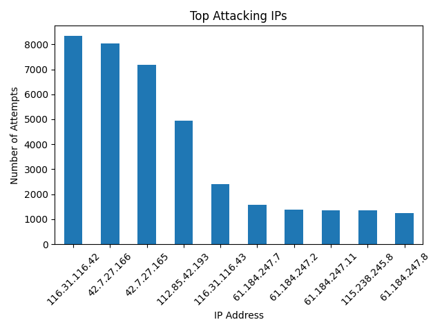
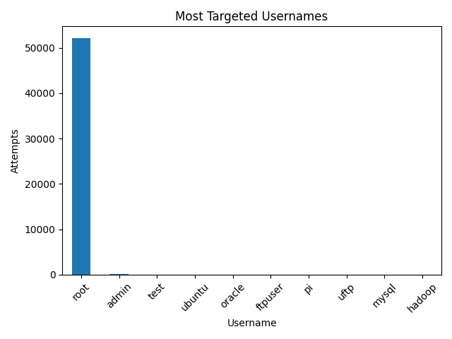
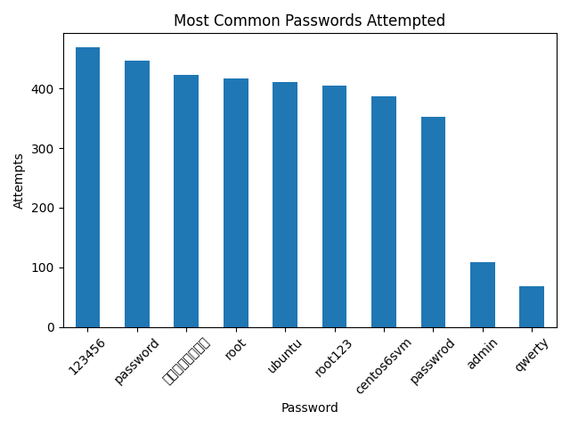
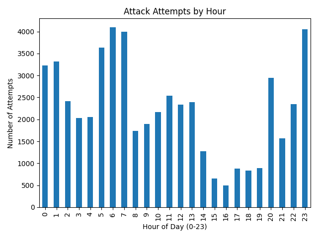

# Detecting and Analyzing SSH Brute Force Attacks Using Log Data

## Overview

This project simulates a real-world security analysis scenario by examining SSH brute-force attack data. The goal is to identify malicious activity, detect high-risk attackers, and uncover patterns in how brute-force attacks are executed.

## Problem

Brute-force attacks attempt to gain unauthorized access by repeatedly trying different username/password combinations. Detecting these patterns is critical for securing systems.

## Dataset

This project uses the **SSH Brute Force dataset** from Kaggle.

To run the project:

1. Download the dataset from Kaggle  
2. Place the file in the following directory:
data/brute_force_data.json

### Dataset Details
- Contains attacker IPs, usernames, timestamps, and attempted passwords  
- Each record represents a session of multiple password attempts  
- Expanded into over 53,000 individual login attempts for analysis  


## Tools Used

* Python (Pandas, Matplotlib)
* Data analysis and visualization

## Key Findings

### 1. High-Volume Automated Attacks
- The top attacking IP generated over 8,000 login attempts
- Multiple IPs exceeded 5,000 attempts
- This pattern strongly indicates automated brute-force tools rather than manual attempts

### 2. Privileged Accounts Are Primary Targets
- Over 97% of login attempts targeted the `root` account
- Attackers prioritize high-privilege access to maximize impact upon success

### 3. Credential Stuffing Behavior
- Frequently attempted passwords include:
  - 123456
  - password
  - root
  - admin
- Indicates use of common password dictionaries in brute-force attacks

### 4. Evidence of Distributed Attacks
- Multiple IP addresses generated thousands of attempts
- Suggests coordinated or botnet-driven attack behavior

### 5. Time-Based Attack Patterns
- Attack activity is concentrated during specific hours
- This pattern suggests scheduled or automated attack execution rather than random activity

## Methodology

- Parsed JSON-based attack data using Python
- Expanded nested password attempts into individual events (~53K rows)
- Aggregated attack data by IP, username, and time
- Visualized attack patterns using Matplotlib

## Visualizations

### Top Attacking IPs



### Most Targeted Usernames



### Common Passwords



### Attack Patterns Over Time


## How to Run

```bash
pip install -r requirements.txt
python src/analyze_logs.py
```

## Future Improvements

* Add attacker IP risk scoring
* Implement IP risk scoring
* Integrate with a dashboard (Tableau / Power BI)
* Analyze real system logs (auth.log)
